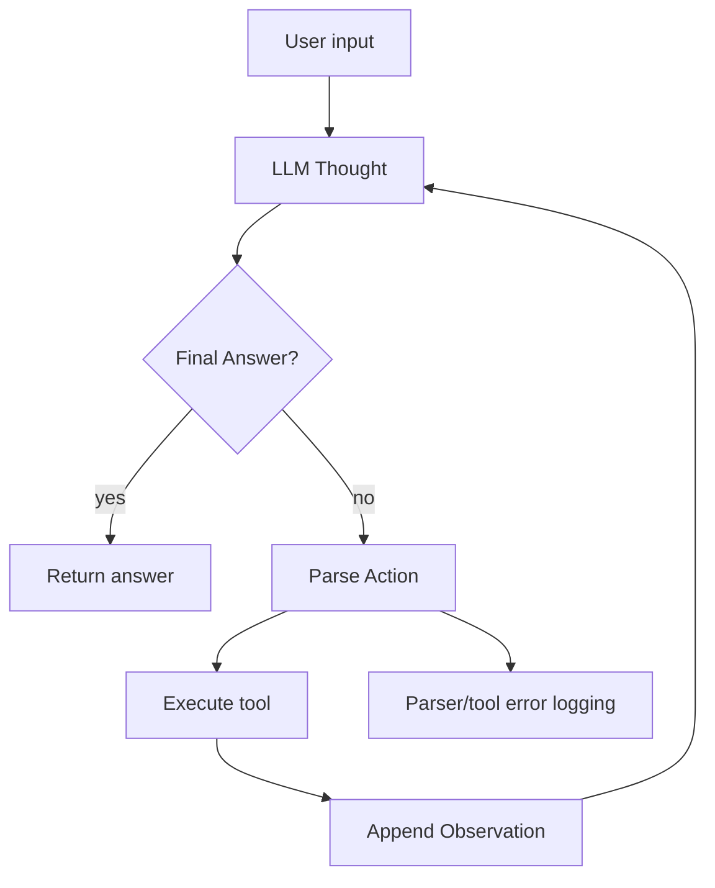

# Group Report: Lab 3 - Production-Grade Agentic System

- **Team Name**: DoVanCung
- **Team Members**: Do Van Cung
- **Deployment Date**: 2026-06-01

---

## 1. Executive Summary

This project implements an e-commerce ReAct agent and compares it with a direct chatbot baseline. The chatbot answers from its own text generation only, while the agent can call tools for product data, discounts, shipping, and arithmetic.

- **Evaluation set**: 3 local cases
- **Chatbot Success Rate**: 1/3 = 33.3%
- **Agent Success Rate**: 3/3 = 100%
- **Key Outcome**: The ReAct agent solved both multi-step order-total tasks because it grounded each intermediate step in tool observations. The chatbot failed those cases because it could only estimate.

Results are stored in `report/evaluation/evaluation_results.csv`.

---

## 2. System Architecture & Tooling

### 2.1 ReAct Loop Implementation

The core loop is implemented in `src/agent/agent.py`. It builds a scratchpad, requests one model step, parses `Action: tool_name({...})`, executes the matching Python function, appends `Observation`, and repeats until `Final Answer` or `max_steps`.

### 2.2 Tool Definitions

| Tool Name | Input Format | Use Case |
| :--- | :--- | :--- |
| `get_product_info` | `{"item_name": "iphone"}` | Returns product price, weight, and stock. |
| `get_discount` | `{"coupon_code": "SAVE10"}` | Returns coupon discount percentage. |
| `calc_shipping` | `{"weight_kg": 1.2, "destination": "Hanoi"}` | Calculates shipping cost. |
| `calculator` | `{"expression": "2*80+5"}` | Evaluates safe arithmetic for final totals. |

### 2.3 LLM Providers Used

- **Primary for offline evaluation**: `ScriptedProvider`, a deterministic local provider for repeatable tests.
- **Production-ready options**: OpenAI, Gemini, and local GGUF model providers are available through the existing provider interface.

---

## 3. Telemetry & Performance Dashboard

The system logs structured JSON events to `logs/2026-06-01.log`.

| Metric | Result |
| :--- | :--- |
| Chatbot success | 1/3 |
| Agent success | 3/3 |
| Agent steps for multi-step tasks | 5 |
| Agent steps for concept task | 1 |
| Error tracking | Parser error, hallucinated tool, tool argument error, runtime error, timeout |
| Cost tracking | Mock cost estimate based on total tokens |

Because the local evaluation uses `ScriptedProvider`, latency is near zero and should not be treated as a real LLM latency benchmark. With OpenAI/Gemini/local GGUF, the same telemetry captures real request latency and token usage.

---

## 4. Root Cause Analysis - Failure Traces

### Case Study: Baseline Chatbot Cannot Ground Multi-Step Totals

- **Input**: "I want to buy 2 iphone using coupon WINNER and ship to Hanoi. What is the final total?"
- **Chatbot Output**: "I estimate the total is about $1000, but I cannot verify stock, coupon, or shipping without tools."
- **Root Cause**: The chatbot has no access to inventory, coupon, shipping, or calculator tools.
- **Fix**: The ReAct agent decomposes the task:
  1. `get_product_info({"item_name": "iphone"})`
  2. `get_discount({"coupon_code": "WINNER"})`
  3. `calc_shipping({"weight_kg": 0.8, "destination": "Hanoi"})`
  4. `calculator({"expression": "2*799*(1-15/100)+5"})`

### Case Study: Potential Hallucinated Tool

- **Risk**: The model may output a tool name that does not exist.
- **Detection**: `_execute_tool` logs `HALLUCINATED_TOOL`.
- **Resolution**: The v2 system prompt explicitly says not to invent tool names and lists exact schemas.

---

## 5. Ablation Studies & Experiments

### Experiment 1: Prompt v1 vs Prompt v2

- **Prompt v1**: Basic ReAct instructions and a simple tool list.
- **Prompt v2**: Adds exact JSON tool-call format, one-tool-per-step rule, no hallucinated tools rule, and a complete few-shot trace.
- **Expected effect**: Fewer parser errors and invalid tool arguments.

### Experiment 2: Chatbot vs Agent

| Case | Chatbot Result | Agent Result | Winner |
| :--- | :--- | :--- | :--- |
| iPhone order total | Incorrect estimate | `$1363.30` | Agent |
| Headphones order total | Incorrect estimate | `$149.00` | Agent |
| ReAct definition | Correct | Correct | Draw |

---

## 6. Production Readiness Review

- **Security**: The calculator uses Python AST with a whitelist of numeric operators instead of `eval`.
- **Guardrails**: The agent has `max_steps` to avoid infinite loops.
- **Observability**: All major events are JSON logged: start, step, tool observation, metric, error, and end.
- **Scaling**: In production, this architecture can be moved to LangGraph or another state-machine framework for branching, retries, and human approval.
- **Next improvement**: Replace the in-memory e-commerce data with a database or API, then add evaluation over a larger benchmark set.
