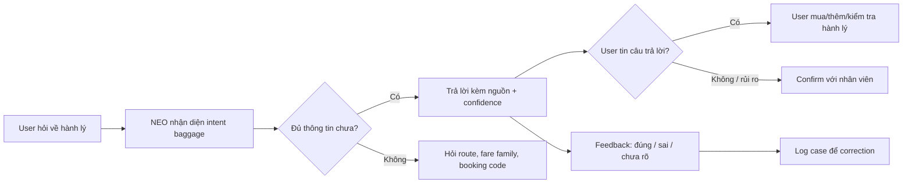

# Workshop - Mổ App AI Thật

**Học viên:** Đỗ Văn Cung  
**Mã học viên:** 2A202600793  
**Ngày làm:** 03/06/2026  
**Sản phẩm chọn:** Vietnam Airlines - NEO Virtual Assistant  
**AI feature:** Chatbot hỗ trợ hành khách tra cứu thông tin về vé máy bay, chuyến bay, hành lý và mua dịch vụ bổ sung.

## 1. Product promise

NEO được Vietnam Airlines giới thiệu là trợ lý ảo hỗ trợ hành khách 24/7, giúp người dùng tra cứu và nhận câu trả lời nhanh cho các câu hỏi về thông tin hành trình, mua vé, thanh toán và các vấn đề liên quan. Trên trang chính thức, NEO được đặt trong khu vực Helpdesk và có nhóm capability rõ: tra cứu vé/chuyến bay/hành lý, trả lời câu hỏi về mua vé và mua hành lý.

**User được hứa sẽ được giúp:** hành khách Vietnam Airlines đang cần câu trả lời nhanh trước khi đặt vé hoặc trước khi ra sân bay.

**Task tôi kỳ vọng AI làm được:** khi user hỏi một câu cụ thể về hành lý, ví dụ "Tôi bay SGN-HAN hạng phổ thông, được mang bao nhiêu kg hành lý ký gửi?", NEO nên hỏi tiếp nếu thiếu thông tin về loại vé/chặng bay, sau đó đưa ra kết quả có nguồn và cách mua thêm hành lý nếu cần.

## 2. Evidence

### Screenshot


### Observation từ self-use

| Evidence | Nơi quan sát được | Product meaning |
|---|---|---|
| Trang NEO hiện "Chat with NEO Vietnam Airlines' Virtual Assistant" và nói NEO hỗ trợ 24/7 cho itinerary, ticket purchase, payment. | Trang NEO chính thức của Vietnam Airlines. | NEO được đặt kỳ vọng là công cụ trả lời nhanh, không chỉ là FAQ tĩnh. |
| Trang liệt kê capability "Look up information about flight tickets, flights and baggage allowance" và "Answer ticket and baggage purchase questions". | Trang NEO chính thức. | Hành lý là một use case chính của NEO, nên cần flow riêng cho baggage allowance. |
| Phần tips ghi user nên hỏi ngắn gọn, rõ ràng; nếu NEO không giải được thì hành khách sẽ được chuyển sang customer support agent. | Phần tips trên trang NEO. | Product đã có ý thức về low-confidence/fallback, nhưng cần làm rõ trigger và đường chuyển agent. |
| Khi tôi bấm nút "Chat with NEO" trên trang public, trang vẫn ở lại nội dung mô tả NEO; không mở được transcript hỏi-đáp trong lần test này. | Self-use trên web public. | Entry point của chatbot trên web public chưa tạo được một session chat rõ ràng trong observation này. |

### Quote / source

- Vietnam Airlines NEO page: "Convenient to look up and get answers quickly (24/7)" cho các câu hỏi về itinerary, ticket purchase, payment và hơn nữa. Source: <https://www.vietnamairlines.com/gb/en/support/chatbot>
- Vietnam Airlines Terms of Use for NEO Chatbot nói response của NEO có thể chứa nội dung không chính xác hoặc không phản ánh đầy đủ quan điểm của Vietnam Airlines. Source: <https://www.vietnamairlines.com/ca/en/support/condition-of-chatbot-NEO>

### Prompt/input đã thử

Do widget chat không mở được thành công trong lần test web public, tôi chưa có transcript hỏi-đáp thật. Prompt dự kiến để test tiếp:

```text
Tôi bay SGN-HAN hạng phổ thông, vé không rõ gói hành lý.
Tôi được ký gửi bao nhiêu kg?
Nếu vượt thì mua thêm ở đâu?
```

## 3. Promise vs Reality

| Câu hỏi | Nhận xét |
|---|---|
| Product hứa gì? | Trả lời nhanh 24/7 cho các câu hỏi liên quan đến chuyến bay, vé, thanh toán và hành lý. |
| User nào được giúp? | Hành khách đang chuẩn bị mua vé, sắp bay, hoặc đang cần quyết định nhanh về hành lý/dịch vụ bổ sung. |
| Kỳ vọng AI làm task nào? | Nhận diện intent "baggage allowance", hỏi lại thông tin thiếu, đưa câu trả lời có nguồn, và gợi ý bước tiếp theo. |
| Điểm gãy nằm ở đâu? | Entry point chat trên web public chưa mở session chat rõ trong lần test; Terms thừa nhận response có thể sai, nhưng UX trên trang mô tả chưa cho thấy cơ chế verify/source/undo trước các quyết định có chi phí. |

## 4. Four Paths

| Path | Hiện trạng / observation | Đề xuất cho product |
|---|---|---|
| Happy | User hỏi đúng phạm vi: chuyến bay, vé, hành lý. NEO có thể trả lời nhanh dựa trên FAQ/booking data. | Trả lời ngắn, có câu "áp dụng cho..." và link nguồn chính thức. Nếu có booking code thì cho phép user kiểm tra theo booking. |
| Low-confidence | Trang tips nói nếu NEO không giải được sẽ chuyển customer support agent, nhưng không thấy rõ trigger. | Khi thiếu thông tin như fare family, domestic/international, itinerary, NEO nên hỏi lại 2-3 câu hoặc show options để user chọn. |
| Failure | Nếu NEO trả lời sai về hành lý/phi mua thêm, user có thể ra sân bay bị tính phí, trễ check-in, hoặc mang sai đồ. | Các câu hỏi có rủi ro chi phí/pháp lý/an toàn cần có confidence label, nguồn, thời điểm cập nhật, và nút "confirm with agent". |
| Correction | Terms nói content/log có thể được dùng để kiểm soát và nâng cao chất lượng, nhưng user không thấy được correction loop trong UI public. | Sau mỗi câu trả lời nên có "Đúng/Sai/Cần nhân viên" và log lý do sai để training/test lại case. |

## 5. Finding -> Product Decision

Khi user hỏi về hành lý trước chuyến bay, AI/product hứa có thể trả lời nhanh nhưng entry point và recovery path trên web public chưa đủ rõ, trong khi Terms lại thừa nhận response có thể không chính xác. Hậu quả là user có thể đưa ra quyết định có chi phí như mua thêm hành lý, đóng gói đồ, hoặc ra sân bay với thông tin sai.

Lỗi thuộc layer **data-tool + safety + UX recovery**.

Nên sửa bằng product requirement:

- NEO phải phân loại các intent rủi ro cao: baggage allowance, fee, refund, ticket change, travel document.
- Với intent baggage, NEO không được trả lời một câu chung chung nếu thiếu route, fare family, membership tier, và ticket condition.
- Câu trả lời phải có nguồn chính thức/link đến baggage policy hoặc booking data, kèm "last updated/valid for".
- Nếu confidence thấp hoặc user hỏi câu có thể gây mất tiền, NEO phải chuyển sang customer support agent hoặc đưa nút "kiểm tra theo mã đặt chỗ".

## 6. Sketch As-is / To-be

| As-is | To-be |
|---|---|
| User vào Helpdesk -> bấm Chat with NEO -> đọc promise "trả lời nhanh 24/7" -> hỏi về hành lý -> có nguy cơ nhận câu trả lời chung chung/không rõ nguồn -> user tự quyết định. | User vào Helpdesk -> bấm Chat with NEO -> chọn "Baggage allowance" -> NEO hỏi route + fare family + booking code optional -> NEO trả lời có nguồn + confidence -> nếu thiếu/sai/thấp confidence thì show 2 options: "hỏi tiếp" hoặc "confirm with agent". |
| Điểm gãy: user không thấy rõ low-confidence trigger, source, hoặc correction loop. | Điểm sửa: low-confidence path được thiết kế thành một bước riêng trước khi user ra quyết định có chi phí. |



## 7. SPEC impact

Finding này sẽ đổi SPEC theo hướng build một slice nhỏ:

```text
Cho hành khách Vietnam Airlines sắp bay và không chắc về hành lý,
prototype dùng AI để hỏi lại thông tin thiếu và gợi ý hành lý hợp lệ theo route/fare,
tạo ra câu trả lời có nguồn + confidence + next action,
và xử lý failure "AI trả lời sai về hành lý" bằng cách bắt buộc verify/source hoặc chuyển agent khi confidence thấp.
```

## 8. Tự kiểm trước khi nộp

- [x] Có screenshot/observation cụ thể.
- [x] Có đủ 4 paths và nói rõ path nào chưa thấy trong product.
- [x] Finding được viết thành product decision, không chỉ là nhận xét.
- [x] Sketch có as-is và to-be.
- [x] Có một câu nói rõ finding này sẽ đổi gì trong SPEC.

## 9. Reflection cá nhân

**Vai trò cá nhân:** research/self-use và product thinking cho một AI support flow trong ngành hàng không.

**Việc đã làm:**

- Đọc yêu cầu Day05 và template individual workshop.
- Chọn một app AI thật có thể kiểm chứng công khai: Vietnam Airlines NEO.
- Mở trang NEO, chụp screenshot, ghi observation từ trang public.
- Chuyển observation thành finding, 4 paths và đề xuất product requirement.

**AI hỗ trợ phần nào:** AI được dùng để đọc yêu cầu, tổng hợp template, tìm nguồn công khai, cấu trúc hóa finding và viết bản nháp markdown. Quyết định product cuối cùng vẫn dựa trên evidence quan sát được, không dựa trên transcript tưởng tượng.

**Bài học:** Với AI product, lỗi nguy hiểm không chỉ là "bot trả lời sai". Điểm quan trọng hơn là product có nhận ra lúc nào AI không chắc, có bắt user cung cấp thêm thông tin, có show nguồn, và có chuyển sang người thật trước khi user ra quyết định có chi phí hay không.
