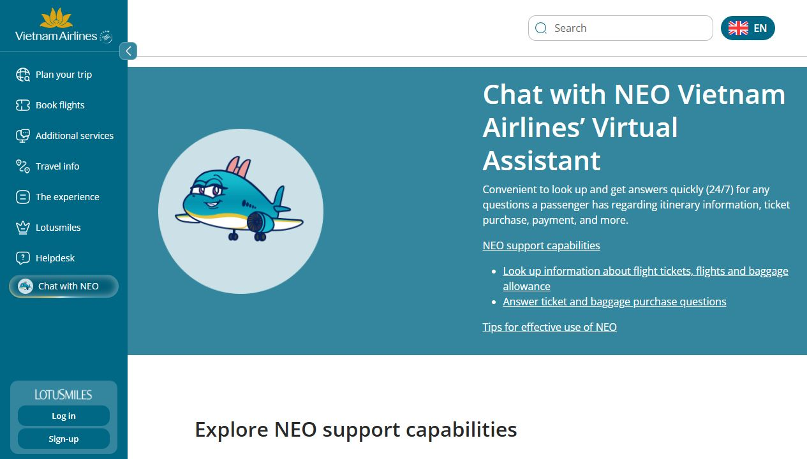
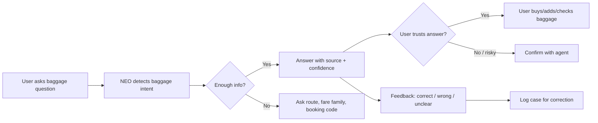

# Workshop - Mổ App AI Thật

**Học viên:** Đỗ Văn Cung  
**Mã học viên:** 2A202600793  
**Ngày làm:** 03/06/2026  
**Sản phẩm chọn:** Vietnam Airlines - NEO Virtual Assistant  
**AI feature:** Chatbot hỗ trợ hành khách tra cứu thông tin về vé máy bay, chuyến bay, hành lý và mua dịch vụ bổ sung.

## 1. Product promise

NEO duoc Vietnam Airlines gioi thieu la tro ly ao ho tro hanh khach 24/7, giup "look up and get answers quickly" cho cac cau hoi ve itinerary information, ticket purchase, payment va cac van de lien quan. Tren trang chinh thuc, NEO duoc dat trong khu vuc Helpdesk va co nhom capability ro: tra cuu ve/chuyen bay/hanh ly, tra loi cau hoi ve mua ve va mua hanh ly.

**User duoc hua se duoc giup:** hanh khach Vietnam Airlines dang can cau tra loi nhanh truoc khi dat ve hoac truoc khi ra san bay.

**Task toi ky vong AI lam duoc:** khi user hoi mot cau hoi cu the ve hanh ly, vi du "Toi bay SGN-HAN hang pho thong, duoc mang bao nhieu kg hanh ly ky gui?", NEO nen hoi tiep neu thieu thong tin ve loai ve/chang bay, sau do dua ra ket qua co nguon va cach mua them hanh ly neu can.

## 2. Evidence

### Screenshot



### Observation tu self-use

| Evidence | Noi quan sat duoc | Product meaning |
|---|---|---|
| Trang NEO hien "Chat with NEO Vietnam Airlines' Virtual Assistant" va noi NEO ho tro 24/7 cho itinerary, ticket purchase, payment | NEO duoc dat ky vong la cong cu tra loi nhanh, khong chi la FAQ tinh | User co the tin day la kenh chinh de quyet dinh truoc chuyen bay |
| Trang liet ke capability "Look up information about flight tickets, flights and baggage allowance" va "Answer ticket and baggage purchase questions" | Hanh ly la mot use case chinh cua NEO | Nen co flow rieng cho baggage allowance, khong chi tra loi chung chung |
| Phan tips ghi user nen hoi ngan gon, ro rang; neu NEO khong giai duoc thi hanh khach se duoc chuyen sang customer support agent | Product da co y thuc ve low-confidence/fallback | Can lam ro khi nao bi coi la "unsolved", va user thay nut/duong chuyen agent o dau |
| Khi toi bam nut "Chat with NEO" tren trang public, trang van o lai noi dung mo ta NEO; khong mo duoc transcript hoi-dap trong lan test nay | Entry point cua chatbot tren web public chua tao duoc mot session chat ro rang trong observation nay | Neu user dang gap viec gap, entry/recovery chua du ro co the lam ho bo cuoc |

### Quote / source

- Vietnam Airlines NEO page: "Convenient to look up and get answers quickly (24/7)" cho cac cau hoi ve itinerary, ticket purchase, payment va hon nua. Source: <https://www.vietnamairlines.com/gb/en/support/chatbot>
- Vietnam Airlines Terms of Use for NEO Chatbot noi response cua NEO co the chua noi dung khong chinh xac hoac khong phan anh day du quan diem cua Vietnam Airlines. Source: <https://www.vietnamairlines.com/ca/en/support/condition-of-chatbot-NEO>

### Prompt/input da thu

Do widget chat khong mo duoc thanh cong trong lan test web public, toi chua co transcript hoi-dap that. Prompt du kien de test tiep:

```text
Toi bay SGN-HAN hang pho thong, ve khong ro goi hanh ly. Toi duoc ky gui bao nhieu kg? Neu vuot thi mua them o dau?
```

## 3. Promise vs Reality

| Cau hoi | Nhan xet |
|---|---|
| Product hua gi? | Tra loi nhanh 24/7 cho cac cau hoi lien quan den chuyen bay, ve, thanh toan va hanh ly. |
| User nao duoc giup? | Hanh khach dang chuan bi mua ve, sap bay, hoac dang can quyet dinh nhanh ve hanh ly/dich vu bo sung. |
| Ky vong AI lam task nao? | Nhan dien intent "baggage allowance", hoi lai thong tin thieu, dua cau tra loi co nguon, va goi y buoc tiep theo. |
| Diem gay nam o dau? | Entry point chat tren web public chua mo session chat ro trong lan test; thong tin Terms thua nhan response co the sai, nhung UX tren trang mo ta chua thay co co che verify/source/undo truoc cac quyet dinh co chi phi. |

## 4. Four Paths

| Path | Hien trang / observation | De xuat cho product |
|---|---|---|
| Happy | User hoi dung pham vi: chuyen bay, ve, hanh ly. NEO co the tra loi nhanh dua tren FAQ/booking data. | Tra loi ngan, co cau "ap dung cho..." va link nguon chinh thuc. Neu co booking code thi cho phep user kiem tra theo booking. |
| Low-confidence | Trang tips noi neu NEO khong giai duoc se chuyen customer support agent, nhung khong thay ro trigger. | Khi thieu thong tin nhu fare family, domestic/international, itinerary, NEO nen hoi lai 2-3 cau hoac show options de user chon. |
| Failure | Neu NEO tra loi sai ve hanh ly/phi mua them, user co the ra san bay bi tinh phi, tre check-in, hoac mang sai do. | Cac cau hoi co rui ro chi phi/phap ly/an toan can co confidence label, nguon, thoi diem cap nhat, va nut "confirm with agent". |
| Correction | Terms noi content/log co the duoc dung de kiem soat va nang cao chat luong, nhung user khong thay duoc correction loop trong UI public. | Sau moi cau tra loi nen co "Dung/Sai/Can nhan vien" va log ly do sai de training/test lai case. |

## 5. Finding -> Product Decision

Khi user hoi ve hanh ly truoc chuyen bay, AI/product hua co the tra loi nhanh nhung entry point va recovery path tren web public chua du ro, trong khi Terms lai thua nhan response co the khong chinh xac. Hau qua la user co the dua ra quyet dinh co chi phi nhu mua them hanh ly, dong goi do, hoac ra san bay voi thong tin sai.

Loi thuoc layer **data-tool + safety + UX recovery**.

Nen sua bang product requirement:

- NEO phai phan loai cac intent rui ro cao: baggage allowance, fee, refund, ticket change, travel document.
- Voi intent baggage, NEO khong duoc tra loi mot cau chung chung neu thieu route, fare family, membership tier, va ticket condition.
- Cau tra loi phai co nguon chinh thuc/link den baggage policy hoac booking data, kem "last updated/valid for".
- Neu confidence thap hoac user hoi cau co the gay mat tien, NEO phai chuyen sang customer support agent hoac dua nut "kiem tra theo ma dat cho".

## 6. Sketch As-is / To-be

| As-is | To-be |
|---|---|
| User vao Helpdesk -> bam Chat with NEO -> doc promise "tra loi nhanh 24/7" -> hoi ve hanh ly -> co nguy co nhan cau tra loi chung chung/khong ro nguon -> user tu quyet dinh. | User vao Helpdesk -> bam Chat with NEO -> chon "Baggage allowance" -> NEO hoi route + fare family + booking code optional -> NEO tra loi co nguon + confidence -> neu thieu/sai/thap confidence thi show 2 options: "hoi tiep" hoac "confirm with agent". |
| Diem gay: user khong thay ro low-confidence trigger, source, hoac correction loop. | Diem sua: low-confidence path duoc thiet ke thanh mot buoc rieng truoc khi user ra quyet dinh co chi phi. |



## 7. SPEC impact

Finding nay se doi SPEC theo huong build mot slice nho:

```text
Cho hanh khach Vietnam Airlines sap bay va khong chac ve hanh ly,
prototype dung AI de hoi lai thong tin thieu va goi y hanh ly hop le theo route/fare,
tao ra cau tra loi co nguon + confidence + next action,
va xu ly failure "AI tra loi sai ve hanh ly" bang cach bat buoc verify/source hoac chuyen agent khi confidence thap.
```

## 8. Tu kiem truoc khi nop

- [x] Co screenshot/observation cu the.
- [x] Co du 4 paths va noi ro path nao chua thay trong product.
- [x] Finding duoc viet thanh product decision, khong chi la nhan xet.
- [x] Sketch co as-is va to-be.
- [x] Co mot cau noi ro finding nay se doi gi trong SPEC.

## 9. Reflection ca nhan

**Vai tro ca nhan:** research/self-use va product thinking cho mot AI support flow trong nganh hang khong.

**Viec da lam:**

- Doc yeu cau Day05 va template individual workshop.
- Chon mot app AI that co the kiem chung cong khai: Vietnam Airlines NEO.
- Mo trang NEO, chup screenshot, ghi observation tu trang public.
- Chuyen observation thanh finding, 4 paths va de xuat product requirement.

**AI ho tro phan nao:** AI duoc dung de doc yeu cau, tong hop template, tim nguon cong khai, cau truc hoa finding va viet ban nhap markdown. Quyet dinh product cuoi cung van dua tren evidence quan sat duoc, khong dua tren transcript tuong tuong.

**Bai hoc:** Voi AI product, loi nguy hiem khong chi la "bot tra loi sai". Diem quan trong hon la product co nhan ra luc nao AI khong chac, co bat user cung cap them thong tin, co show nguon, va co chuyen sang nguoi that truoc khi user ra quyet dinh co chi phi hay khong.
