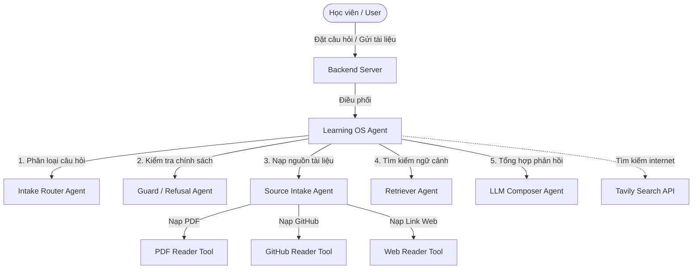

# Tổng Hợp Kết Quả Thực Hiện - Learning OS Support Agent

Tài liệu này tổng hợp toàn bộ các phần việc, cải tiến và tích hợp đã hoàn thành cho dự án **Learning OS Support Agent** (AI Learning Companion) tại repo `Day6-E403-D5`.

---

## 1. Tổng Quan Kiến Trúc Hệ Thống (Multi-Agent System)

Hệ thống được thiết kế theo mô hình **Multi-Agent Orchestrator**, gồm một Agent điều phối chính ([learning_agent.py](file:///Users/vuanh4569/Coding/VinUniHomeWork/Day6-E403-D5/codebase/backend/learning_agent.py)) phối hợp cùng 5 Agent chuyên biệt đóng vai trò như các Agent con (Sub-agents) và hệ thống công cụ bổ trợ (Tools).



---

## 2. Các Cải Tiến & Tính Năng Đã Thực Hiện

### 2.1. Nâng Cấp Frontend & Trải Nghiệm Người Dùng (UI/UX)
*   **Chuyển đổi mã nguồn**: Toàn bộ mã nguồn giao diện đã được cấu trúc lại, chuyển đổi từ tệp cũ `app.js` sang tệp mới tối ưu hơn là [script.js](file:///Users/vuanh4569/Coding/VinUniHomeWork/Day6-E403-D5/codebase/prototype/script.js).
*   **Giao diện Hiện đại & Responsive**:
    *   Thiết kế giao diện thẻ chat với thanh điều hướng bên (drawer) chứa lịch sử trò chuyện.
    *   Hỗ trợ tạo mới, xóa, đổi tên cuộc trò chuyện và lưu trạng thái trực tiếp vào `localStorage`.
    *   Hỗ trợ chuyển đổi giao diện Sáng/Tối (Light/Dark Theme) mượt mà dựa trên tùy chọn người dùng và cấu hình hệ thống.
*   **Trình phân tích cú pháp Markdown**:
    *   Tự viết bộ phân tích Markdown phía Client hỗ trợ định dạng tiêu đề, danh sách, in đậm, in nghiêng, trích dẫn (`blockquote`) và khối mã nguồn (`code-block`).
    *   Tích hợp nút Sao chép (Copy) nhanh cho cả toàn bộ tin nhắn hoặc riêng phân đoạn mã nguồn cụ thể.
*   **Tải tài liệu trực tiếp**:
    *   Giao diện hỗ trợ nút đính kèm và kéo thả tệp tin `.txt`, `.md`, `.pdf`.
    *   Các tệp tin được đọc và mã hóa trực tiếp dưới dạng Base64 hoặc text để truyền tải lên API Backend `/api/source` một cách tự động.

### 2.2. Hoàn Thiện Core Agent & Bộ Định Tuyến (Orchestrator & Router)
*   **Xử lý Lịch sử Hội thoại**: Tối ưu hóa độ dài ngữ cảnh bằng cách giới hạn tối đa 10 tin nhắn gần nhất (`cleaned[-10:]`) gửi lên LLM để tránh tình trạng tràn token và đảm bảo tốc độ phản hồi nhanh.
*   **Định tuyến Ý định Tóm tắt**: Tự động phát hiện khi người dùng vừa tải lên tài liệu mới để chuyển sang chế độ `summarize_source` (Tóm tắt tài liệu) thay vì trả lời câu hỏi thông thường.
*   **Hiển thị nguồn trích dẫn**: Sửa lỗi hiển thị chuỗi Base64 dài khi trích dẫn tài liệu tải lên bằng cách định dạng lại nhãn nguồn thành `"Tệp tải lên"` thân thiện với người dùng.

### 2.3. Tích Hợp Hệ Thống Bảo Vệ Chính Sách (Guard Agent)
*   Tệp logic [codebase/backend/agents/guard/agent.py](file:///Users/vuanh4569/Coding/VinUniHomeWork/Day6-E403-D5/codebase/backend/agents/guard/agent.py) đã được hiện thực hóa đầy đủ:
    *   **Bộ lọc Từ khóa Nhanh (Fast Heuristic Fallback)**: Kiểm tra các từ khóa tiếng Việt không dấu/có dấu thuộc nhóm ngoài phạm vi (như nấu ăn, thời tiết, bóng đá, xem phim, xổ số, lô đề...) để từ chối ngay lập tức mà không cần gọi API LLM, giúp tiết kiệm chi phí và giảm độ trễ tối đa.
    *   **LLM Guard Check**: Trong trường hợp từ khóa đi qua được bộ lọc nhanh, Guard Agent sẽ phân tích kỹ hơn bằng mô hình LLM để phát hiện các câu hỏi vi phạm chính sách của khóa học, câu hỏi ngoài phạm vi học tập hoặc thiếu tài liệu nguồn để tự tin trả lời.
    *   **Ngăn chặn đoán mò**: Từ chối trả lời về thời hạn (deadline) hoặc quy chế nội bộ nếu chưa có nguồn thông tin chính thức được nạp vào hệ thống.

### 2.4. Phát Triển & Hoàn Thiện Các Công Cụ Nạp Tài Liệu (Tools)
*   **GitHub Reader Tool**:
    *   Tích hợp công cụ Node.js microservice (`github-reader-tool`) chạy trên cổng `3000` để cào và đọc các repo public một cách tối ưu.
    *   Nếu dịch vụ Node.js chưa hoạt động, [github_tool.py](file:///Users/vuanh4569/Coding/VinUniHomeWork/Day6-E403-D5/codebase/backend/tools/github_tool.py) sẽ tự động khởi chạy ngầm dịch vụ này.
    *   Cung cấp cơ chế Fallback bằng Python thuần đọc trực tiếp từ Raw GitHub URL khi gặp lỗi mạng hoặc API Rate Limit.
*   **PDF Reader Tool**:
    *   Nâng cấp [pdf_tool.py](file:///Users/vuanh4569/Coding/VinUniHomeWork/Day6-E403-D5/codebase/backend/tools/pdf_tool.py) hỗ trợ giải mã trực tiếp dữ liệu PDF gửi lên dưới dạng chuỗi Base64 (`data:application/pdf;base64,...`) từ trình duyệt.
    *   Đọc và trích xuất lớp văn bản bằng thư viện `pypdf`/`PyPDF2`. Nếu tệp PDF dạng quét ảnh (scan), hệ thống sẽ trả về trạng thái yêu cầu OCR thay vì lỗi hệ thống.
*   **Tavily Search Tool**: Tìm kiếm thông tin học thuật công khai trên internet khi người dùng hỏi các kiến thức lập trình/AI chung (`general_learning`).

---

## 3. Bản Đồ File Thay Đổi (Git Diff Map)

Dưới đây là danh sách các file chính đã được sửa đổi và bổ sung trong phiên bản này:

*   **Frontend**:
    *   `[NEW]` [codebase/prototype/script.js](file:///Users/vuanh4569/Coding/VinUniHomeWork/Day6-E403-D5/codebase/prototype/script.js) - Script xử lý toàn bộ logic giao diện, lưu trữ cục bộ, phân tích cú pháp Markdown và tải tệp tin.
    *   `[MODIFY]` [codebase/prototype/index.html](file:///Users/vuanh4569/Coding/VinUniHomeWork/Day6-E403-D5/codebase/prototype/index.html) - Cập nhật liên kết script và tối ưu ảnh đại diện.
    *   `[DELETE]` `codebase/prototype/app.js` - Xóa file JS cũ để chuyển sang cấu trúc gọn gàng của `script.js`.
*   **Backend & Agents**:
    *   `[MODIFY]` [codebase/backend/learning_agent.py](file:///Users/vuanh4569/Coding/VinUniHomeWork/Day6-E403-D5/codebase/backend/learning_agent.py) - Tích hợp luồng Guard check, tối ưu lịch sử hội thoại và định dạng nguồn tài liệu hiển thị.
    *   `[MODIFY]` [codebase/backend/agents/guard/agent.py](file:///Users/vuanh4569/Coding/VinUniHomeWork/Day6-E403-D5/codebase/backend/agents/guard/agent.py) - Hiện thực hóa GuardAgent kiểm tra độ an toàn bằng từ khóa nhanh và LLM.
    *   `[MODIFY]` [codebase/backend/agents/answer_composer/agent.py](file:///Users/vuanh4569/Coding/VinUniHomeWork/Day6-E403-D5/codebase/backend/agents/answer_composer/agent.py) - Thêm prompt phân loại tóm tắt nguồn tài liệu (summarize_source) tùy theo kiểu dữ liệu nạp vào (GitHub vs PDF/Web).
    *   `[MODIFY]` [codebase/backend/agents/source_intake/agent.py](file:///Users/vuanh4569/Coding/VinUniHomeWork/Day6-E403-D5/codebase/backend/agents/source_intake/agent.py) - Hỗ trợ phát hiện PDF dạng Base64.
*   **Tools**:
    *   `[MODIFY]` [codebase/backend/tools/github_tool.py](file:///Users/vuanh4569/Coding/VinUniHomeWork/Day6-E403-D5/codebase/backend/tools/github_tool.py) - Tích hợp gọi Node.js microservice đọc GitHub repo và xử lý fallback.
    *   `[MODIFY]` [codebase/backend/tools/pdf_tool.py](file:///Users/vuanh4569/Coding/VinUniHomeWork/Day6-E403-D5/codebase/backend/tools/pdf_tool.py) - Hỗ trợ hiện thực hóa việc giải mã và lưu tạm tệp PDF Base64.
    *   `[NEW]` [codebase/github-reader-tool/](file:///Users/vuanh4569/Coding/VinUniHomeWork/Day6-E403-D5/codebase/github-reader-tool) - Dự án Node.js bổ trợ đọc tài liệu từ GitHub.

---

## 4. Hướng Dẫn Vận Hành Hệ Thống

Để chạy thử nghiệm toàn bộ hệ thống bao gồm cả Frontend và Backend, thực hiện theo các bước sau:

### Bước 1: Thiết lập môi trường (Environment Setup)
1.  Đảm bảo đã tạo file cấu hình `.env` tại thư mục gốc từ mẫu `.env.example`:
    ```bash
    cp .env.example .env
    ```
2.  Mở file `.env` và điền đầy đủ API Key cần thiết (ví dụ: `OPENAI_API_KEY`, `TAVILY_API_KEY`,...).

### Bước 2: Chạy Backend Server
Chạy lệnh khởi động Python backend server từ thư mục gốc của dự án:
```bash
python codebase/backend/server.py
```
*Hệ thống sẽ chạy tại địa chỉ mặc định: `http://127.0.0.1:8060`.*

### Bước 3: Kiểm tra Trạng thái kết nối (Health Check)
Truy cập địa chỉ sau trên trình duyệt để kiểm tra Backend đã đọc thành công các API Key cấu hình hay chưa:
[http://127.0.0.1:8060/api/health](http://127.0.0.1:8060/api/health)

### Bước 4: Sử dụng Giao diện Web
Mở trình duyệt và truy cập:
[http://127.0.0.1:8060](http://127.0.0.1:8060)

Tại đây, bạn có thể kiểm thử toàn bộ luồng hoạt động:
1.  Đặt câu hỏi bình thường (hội thoại tự do).
2.  Đính kèm tệp tin PDF, TXT, MD để hệ thống tự động đọc và đưa ra bản tóm tắt nội dung chi tiết.
3.  Thử đặt câu hỏi ngoài lề (ví dụ: *"Cách nấu lẩu Thái ngon"*) để kiểm tra xem Guard Agent có chặn và từ chối trả lời một cách lịch sự hay không.
