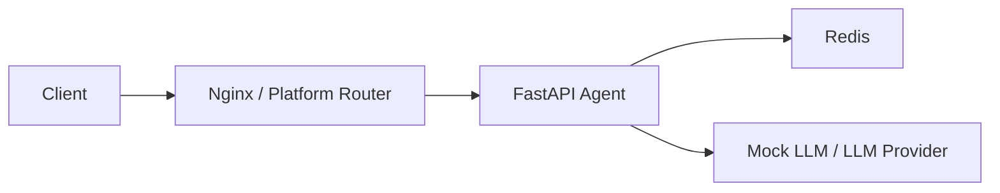

# Day 12 Lab - Mission Answers

## Part 1: Localhost vs Production

### Exercise 1.1: Anti-patterns found

1. `OPENAI_API_KEY` and `DATABASE_URL` are hardcoded in source code.
2. Secrets are printed to logs in `/ask`.
3. `DEBUG=True` and `reload=True` are enabled by default.
4. Host and port are hardcoded to `localhost:8000`.
5. There is no `/health` or `/ready` endpoint for cloud platforms.
6. The app uses `print()` instead of structured logging.
7. There is no graceful shutdown lifecycle for cleanup.
8. Request input is not validated with a clear schema.

### Exercise 1.3: Comparison table

| Feature | Develop | Production | Why Important? |
|---------|---------|------------|----------------|
| Config | Hardcoded values | Environment variables | Cloud platforms inject config at runtime and secrets must stay out of code. |
| Secrets | Fake API key and DB password in code | Loaded from env vars | Prevents accidental credential leaks in Git history and logs. |
| Host/port | `localhost:8000` | `0.0.0.0` and `PORT` env var | Containers must listen on all interfaces and use the platform-assigned port. |
| Health check | Missing | `/health` | Allows the platform to detect failed containers and restart them. |
| Readiness | Missing | `/ready` | Prevents load balancers from routing traffic before the app is initialized. |
| Logging | `print()` and secret values | JSON structured logs without secrets | Structured logs are easier to search and safer in production. |
| Shutdown | Abrupt process exit | Lifespan hook and SIGTERM handler | Lets in-flight work finish before a deploy or restart. |
| CORS | Not configured | Configurable allowed origins | Reduces accidental exposure to untrusted frontends. |

## Part 2: Docker

### Exercise 2.1: Dockerfile questions

1. Base image: `python:3.11`.
2. Working directory: `/app`.
3. `requirements.txt` is copied before source code to reuse Docker layer cache when application code changes but dependencies do not.
4. `CMD` provides the default command that can be overridden at runtime; `ENTRYPOINT` defines the main executable and is harder to override without explicit flags.

### Exercise 2.3: Image size comparison

- Develop: single-stage image based on `python:3.11`, typically much larger because it keeps the full base image and build/runtime files together.
- Production: multi-stage image based on `python:3.11-slim`, typically smaller because build tools stay in the builder stage and only runtime packages are copied.
- Difference: production should be well below the 500 MB requirement, while the develop image can approach or exceed 1 GB depending on dependency cache and platform.

### Exercise 2.4: Docker Compose architecture

The production compose stack starts an agent service, Redis for shared state/rate limiting, and a proxy/load-balancer layer in the advanced examples. Services communicate through an internal Docker network by service name, for example `agent` connects to `redis://redis:6379/0`.



## Part 3: Cloud Deployment

### Exercise 3.1: Railway deployment

- URL: `TODO: add public Railway/Render/Cloud Run URL after deployment`
- Screenshot: `TODO: add screenshots/dashboard.png and screenshots/test.png after deployment`

The final project includes both `railway.toml` and `render.yaml`, so it is ready to deploy after pushing the repository and setting the required environment variables.

## Part 4: API Security

### Exercise 4.1-4.3: Test results

Expected local tests:

```bash
curl http://localhost:8000/health
# 200 OK with {"status":"ok", ...}

curl -X POST http://localhost:8000/ask -H "Content-Type: application/json" -d "{\"question\":\"Hello\"}"
# 401 because X-API-Key is missing

curl -X POST http://localhost:8000/ask -H "X-API-Key: dev-key-change-me" -H "Content-Type: application/json" -d "{\"user_id\":\"test\",\"question\":\"Hello\"}"
# 200 with mock answer
```

Rate limiting is configured at 10 requests per minute. Repeating authenticated `/ask` requests more than 10 times within a minute should return HTTP 429.

### Exercise 4.4: Cost guard implementation

The final project implements cost protection in `06-lab-complete/app/cost_guard.py`. It estimates input/output tokens, records usage, and blocks requests when the configured monthly or daily budget is exhausted. Redis is used when `REDIS_URL` is available so budget state is shared across app instances; otherwise it falls back to in-memory storage for local development.

## Part 5: Scaling & Reliability

### Exercise 5.1-5.5: Implementation notes

- Health check: `GET /health` returns liveness, uptime, version, environment, LLM mode, and storage backend.
- Readiness check: `GET /ready` returns 503 until the app startup lifecycle has completed.
- Stateless design: rate-limit and cost state use Redis when available, so multiple instances share the same counters.
- Graceful shutdown: the app uses FastAPI lifespan hooks and registers a SIGTERM handler.
- Reliability: Docker health checks are defined in both `Dockerfile` and `docker-compose.yml`.
- Security: `/ask` and `/metrics` require `X-API-Key`; secrets are loaded from environment variables.

## Part 6: Final Project

The completed source code is in `06-lab-complete/` and includes:

- Multi-stage Dockerfile
- Docker Compose stack with Redis
- API key authentication
- Redis-backed rate limiting at 10 req/min
- Cost guard with 10 USD monthly budget
- Health and readiness endpoints
- Graceful shutdown
- `.env.example`, `railway.toml`, and `render.yaml`
